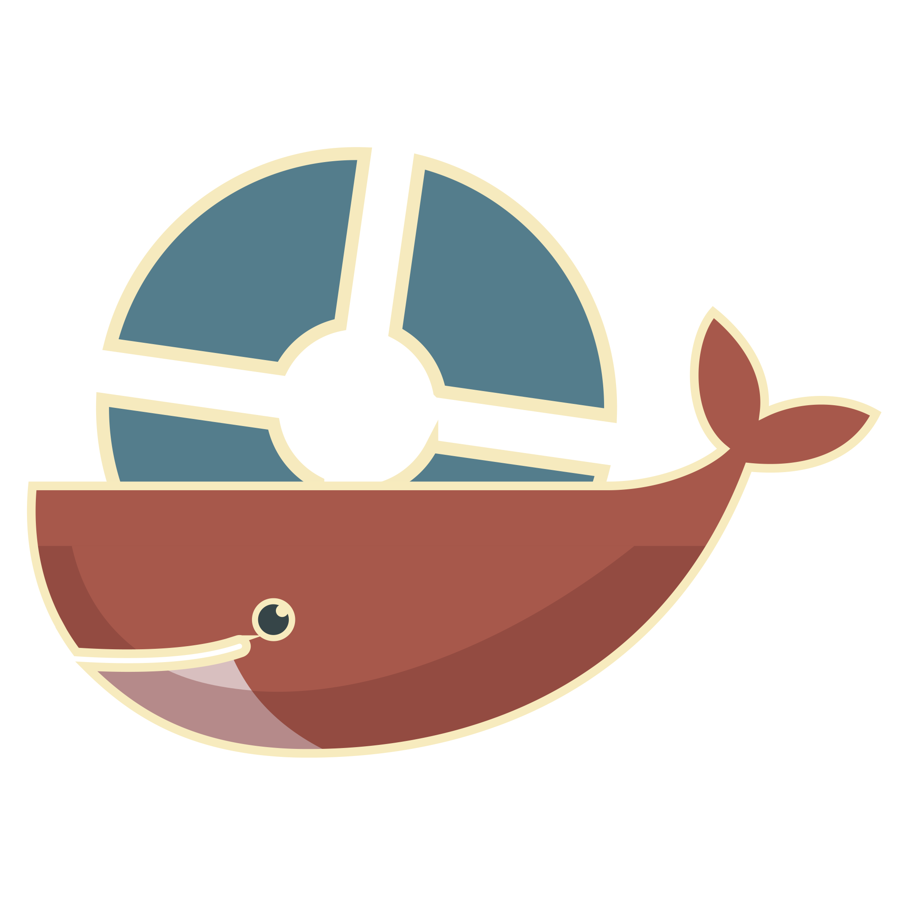

# tf2-servers

<p>
  <a href="https://hub.docker.com/r/melkortf/tf2-base">
    
  </a>
  <a href="https://hub.docker.com/r/melkortf/tf2-base">
    
  </a>
  <a href="https://hub.docker.com/r/melkortf/tf2-base">
    
  </a>
  <a href="https://opensource.org/licenses/MIT">
    
  </a>
</p>

**[Team Fortress 2 Dedicated Server](https://wiki.teamfortress.com/wiki/Linux_dedicated_server) Docker images for multiple purposes**


```
$ docker run \
  -v "maps:/home/tf2/server/tf/maps" \
  -e "RCON_PASSWORD=foobar123" \
  -e "SERVER_HOSTNAME=melkor.tf" \
  -e "STV_NAME=melkor TV" \
  --network=host \
  melkortf/tf2-base
```

### Concerning server.cfg

Each TF2 image has its own `server.cfg.template` file that is used to generate `server.cfg`. The docker container
uses `envsubst` to replace environment variables in the template file.
For example, this line in `server.cfg.template`:
```
rcon_password "${RCON_PASSWORD}"
```

when launched with these params:
```
$ docker run --network=host -e RCON_PASSWORD=123456 -itd melkortf/tf2-base
```
will generate the following `server.cfg`:
```
rcon_password "123456"
```

There are many more configuration options, you will find them all below.


## tf2-base

```
$ docker pull melkortf/tf2-base
```

The base image for all other images; pure TF2 server, without any add-ons and plugins.

Environment variable | Default value | Used in | Description
-------------------- | ------------- | ------- | -----------
IP                   | 0.0.0.0       | `-ip ${IP}` | Specifies the address to use for the bind(2) syscall.
PORT                 | 27015         | `-port ${PORT}` | The port which the server will run on.
CLIENT_PORT          | 27016         | `+clientport ${CLIENT_PORT}` | The client port.
STEAM_PORT           | 27018         | `-steamport ${STEAM_PORT}` | Master server updater port.
STV_PORT             | 27020         | `+tv_port ${STV_PORT}` | SourceTV port.
RCON_PASSWORD        | 123456        | `rcon_password "${RCON_PASSWORD}"` | The RCON passowrd (change this in your `docker run` invocation).
SERVER_HOSTNAME      | A Team Fortress 2 server | `hostname "${SERVER_HOSTNAME}"` | The game server hostname.
SERVER_PASSWORD      |               | `sv_password "${SERVER_PASSWORD}"` | The server password.
STV_NAME             | Source TV     | `tv_name "${STV_NAME}"` | SourceTV host name.
STV_TITLE            | A Team Fortress 2 server Source TV | `tv_title "${STV_TITLE}"` | Title for the SourceTV spectator UI.
STV_PASSWORD         |               | `tv_password "${STV_PASSWORD}"` | SourceTV password.
DOWNLOAD_URL         | https://dl.serveme.tf/ | `sv_downloadurl "${DOWNLOAD_URL}"` | Download URL for the [FastDL](https://developer.valvesoftware.com/wiki/Sv_downloadurl).


## tf2-sourcemod

```
$ docker pull melkortf/tf2-sourcemod
```

TF2 server with [Metamod:Source](https://www.sourcemm.net/) and [SourceMod](https://www.sourcemod.net/) installed.


## tf2-tftrue

```
$ docker pull melkortf/tf2-tftrue
```

TF2 server with [Metamod:Source](https://www.sourcemm.net/), [SourceMod](https://www.sourcemod.net/) and [TFTrue](https://tftrue.esport-tools.net/) addons installed.

Environment variable | Default value | Used in | Description
-------------------- | ------------- | ------- | -----------
LOGS_TF_APIKEY       |               | `tftrue_logs_apikey ${LOGS_TF_APIKEY}` | The API key used to upload logs to logs.tf.
LOGS_TF_PREFIX       |               | `tftrue_logs_prefix ${LOGS_TF_PREFIX}` | The prefix to add in the log name when uploading to logs.tf.


## tf2-competitive

```
$ docker pull melkortf/tf2-competitive
```

TF2 server configured to be used in competitive matches.

Environment variable | Default value | Used in | Description
-------------------- | ------------- | ------- | -----------
DEMOS_TF_APIKEY      |               | sm_demostf_apikey ${DEMOS_TF_APIKEY} | The API key used to upload the demo to [demos.tf](https://demos.tf/).


## tf2-dm

```
$ docker pull melkortf/tf2-dm
```

TF2 dedicated server for DeathMatch gameplay.


## tf2-mge

```
$ docker pull melkortf/tf2-mge
```

TF2 dedicated server for MGE 1v1 training mod.


## Maps

In order to make the image as small as possible, the only map shipped with the image is _cp_badlands_. This has also the advantage of letting you maintain only one directory
with all the maps and share it between all the containers. Just mount `/home/tf2/server/tf/maps` to your local directory that contains all the maps you need:

```
$ docker run -v "/usr/local/data/tf2/maps:/home/tf2/server/tf/maps" --network=host -d melkortf/tf2-base
```

If you want to have all the maps available on [serveme.tf's FastDL](https://dl.serveme.tf/maps/), just type the following command:

```
$ wget -r --no-parent --accept bsp -l1 --cut-dirs=2 --no-host-directories -nc https://dl.serveme.tf/maps/
```

It will download every single map to the current directory.
